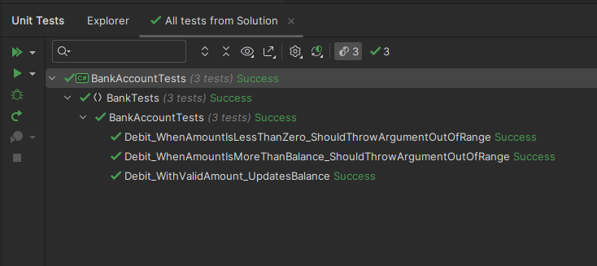

# M9_S3_AtividadeProg

Durante a realização deste projeto utilizamos a ferramenta de teste de unidade do MSTest em C# para o modelo do .NET, que permite que testes unitários sejam realizado em métodos pertencentes a classes do C#, nesse caso todos os métodos da classe “BankAccount”. Com a realização dessa atividade concluímos que a melhoria em um código de teste permite com os testes fiquem mais robustos e informativos para o desenvolvedor, além de melhorarem o código que está sendo testado.

